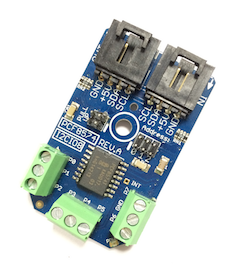

 [](https://www.controleverything.com/products)
# PCF8574
PCF8574 I2C Remote 8-bit I/O Expander

The PCF8574 provides remote I/O expansion via the two-line bidirectional bus (I2C-bus).

This Device is available from ControlEverything.com [SKU: PCF8574_LBAR_I2CL]

https://www.controleverything.com/products

This Sample code can be used with Raspberry Pi, Arduino Nano, Particle Photon and Beaglebone Black.

## Java
Download and install pi4j library on Raspberry pi. Steps to install pi4j are provided at:

http://pi4j.com/install.html

Download (or git pull) the code in pi.

Compile the java program.
```cpp
$> pi4j PCF8574.java
```

Run the java program.
```cpp
$> pi4j PCF8574
```

## Python
Download and install smbus library on Raspberry pi. Steps to install smbus are provided at:

https://pypi.python.org/pypi/smbus-cffi/0.5.1

Download (or git pull) the code in pi. Run the program.

```cpp
$> python PCF8574.py
```

## Arduino
Download and install Arduino Software (IDE) on your machine. Steps to install Arduino are provided at:

https://www.arduino.cc/en/Main/Software

Download (or git pull) the code and double click the file to run the program.

Compile and upload the code on Arduino IDE and see the output on Serial Monitor.


## Particle Photon

Login to your Photon and setup your device according to steps provided at:

https://docs.particle.io/guide/getting-started/connect/photon/

Download (or git pull) the code. Go to online IDE and copy the code.

https://build.particle.io/build/

Verify and flash the code on your Photon. Code output is shown in logs at dashboard:

https://dashboard.particle.io/user/logs


## C
Setup your BeagleBone Black according to steps provided at:

https://beagleboard.org/getting-started

Download (or git pull) the code in Beaglebone Black.

Compile the c program.
```cpp
$>gcc PCF8574.c -o PCF8574
```
Run the c program.
```cpp
$>./PCF8574
```
#####The code output shows the user input.

